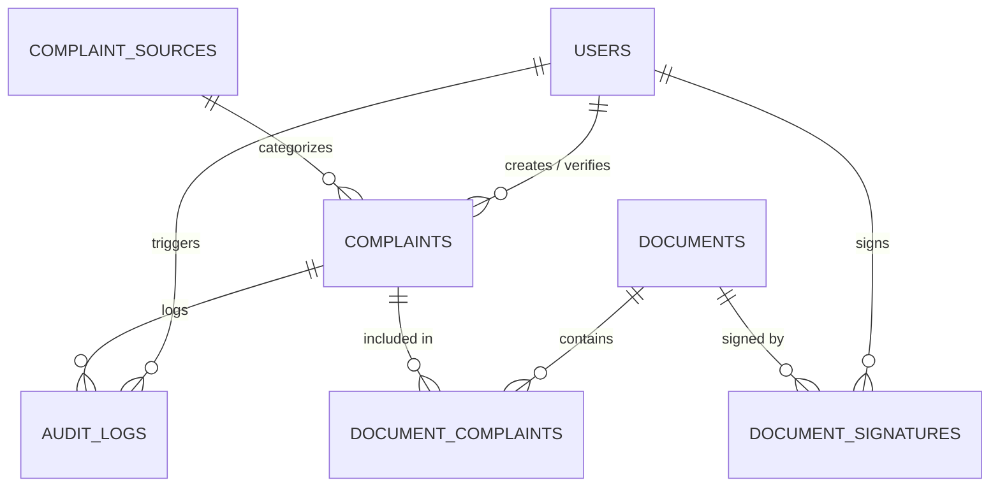

# 🚂 KAI SI-PKP (Sistem Informasi Pengelolaan Keluhan Pelanggan)

[](https://nextjs.org/)
[](https://react.dev/)
[](https://www.typescriptlang.org/)
[](https://www.postgresql.org/)
[](https://www.prisma.io/)
[](https://pptr.dev/)
[](https://tailwindcss.com/)

> **Enterprise Case Study**: Digitalisasi formulir dan rekapitulasi penanganan keluhan pelanggan PT Kereta Api Indonesia (Persero) berdasarkan formulir standar **FR.SM/TI/033.001**, dilengkapi otomasi pelaporan PDF resmi pixel-perfect, alur verifikasi multi-tier, migrasi data Excel legacy, dan audit trail transparan.

---

## 📌 Latar Belakang & Masalah Bisnis

Sebelumnya, dokumentasi penanganan keluhan pelanggan di unit Sistem Informasi PT KAI dikelola menggunakan lembar kerja spreadsheet manual (`FR.SM/TI/033.001`). Proses konvensional ini memiliki keterbatasan:
1. **Risiko Integritas Data**: Tidak ada pelacakan siapa yang mengubah tindakan atau status verifikasi.
2. **Keterlambatan Resolusi**: PIC tidak memiliki notifikasi atau status terpadu untuk membedakan keluhan baru vs tindak lanjut.
3. **Penyusunan Laporan Lambat**: Membutuhkan waktu berjam-jam untuk memformat tabel, menyelaraskan margin cetak, dan mengumpulkan tanda tangan fisik Pelaksana & Management Representative.

### 💡 Solusi: SI-PKP
SI-PKP mentransformasi alur kerja manual tersebut menjadi aplikasi terpadu berbasis web dengan standar dokumen korporat yang ketat.

---

## ✨ Fitur Unggulan

- 📊 **Executive Dashboard**: Monitoring KPI keluhan real-time, grafik tren bulanan, diagram distribusi saluran (Telepon, Email, Survey, Langsung, Medsos, Surat), dan rata-rata durasi penyelesaian.
- 🔄 **State Machine & Lifecycle**: Transisi status terkontrol:
  `BARU` ➔ `DIPROSES` (wajib isi tindakan perbaikan) ➔ `SELESAI` / `PERLU TINDAK LANJUT` (verifikasi PIC).
- 📄 **Automated PDF Generator (FR.SM/TI/033.001)**: Merender laporan resmi A4 Landscape dengan kop surat PT KAI, struktur tabel, border presisi, tanda tangan digital (Pelaksana & Management Rep), dan penomoran otomatis *"Halaman X dari N"*.
- 📑 **Workflow Persetujuan Dokumen**: Alur verifikasi dokumen resmi (`Draft` ➔ `Menunggu Persetujuan` ➔ `Disetujui Management Rep` ➔ `Ditandatangani`).
- 📥 **Batch Excel Migration**: Upload berkas spreadsheet `.xlsx` lama untuk migrasi data keluhan masa lalu secara instan dengan auto-mapping kolom.
- 🛡️ **Role-Based Access Control (RBAC)**: Pembagian peran terperinci (`Admin`, `Staff Pelayanan`, `PIC Verifikator`, `Management Representative`).
- 📜 **Immutable Audit Trail**: Pencatatan log setiap operasi (User, IP Address, User Agent, Nilai Sebelum vs Sesudah).
- 🏷️ **Penomoran Unik Otomatis**: Format `KAI-YYYYMM-XXXXX` (5 digit urut per bulan, mendukung hingga 99.999 keluhan).

---

## 🏗️ Arsitektur Sistem

```
┌─────────────────────────────────────────────────────────────┐
│                       CLIENT LAYER                          │
│     Next.js 16 (App Router) + React 19 + Tailwind CSS       │
│     Recharts (Charts) + Lucide Icons + Radix UI Primitives  │
└──────────────────────────────┬──────────────────────────────┘
                               │ HTTPS / JSON API
┌──────────────────────────────▼──────────────────────────────┐
│                    APPLICATION BACKEND                      │
│   • Next.js Server Actions & API Routes                     │
│   • NextAuth.js v5 (JWT Session & RBAC)                     │
│   • Zod Data Contract Validation (Single Source of Truth)   │
│   • Audit Trail Event Dispatcher                            │
│   • Puppeteer Chromium Engine (HTML-to-PDF Pipeline)        │
│   • SheetJS / XLSX Parser (Legacy Excel Importer)           │
└──────────────────────────────┬──────────────────────────────┘
                               │ Prisma ORM Client
┌──────────────────────────────▼──────────────────────────────┐
│                      DATABASE LAYER                         │
│   PostgreSQL 15 (Docker Container)                          │
│   • users, complaints, complaint_sources, audit_logs        │
│   • documents, document_complaints, document_signatures     │
└─────────────────────────────────────────────────────────────┘
```

---

## 🗄️ Skema Database (Entity Relationship)



---

## 🚀 Memulai Proyek (Quick Start)

### 1. Prasyarat
- Node.js v20+ & npm v10+
- Docker & Docker Compose (untuk PostgreSQL)

### 2. Kloning Repositori
```bash
git clone https://github.com/<username-anda>/kai-sipkp.git
cd kai-sipkp
```

### 3. Instalasi Dependensi
```bash
npm install
```

### 4. Konfigurasi Lingkungan
Salin berkas `.env.example` ke `.env`:
```bash
cp .env.example .env
```

### 5. Jalankan Database PostgreSQL
```bash
docker compose up -d
```

### 6. Sinkronisasi Skema & Data Awal (Seeding)
```bash
npx prisma db push
npm run seed  # atau: npx tsx prisma/seed.ts
```

### 7. Jalankan Server Pengembangan
```bash
npm run dev
```
Akses aplikasi di browser: **`http://localhost:3000`**

---

## 🔑 Kredensial Akun Demo (Development)

Semua akun menggunakan kata sandi standar: **`password123`**

| Peran (Role) | Email | Deskripsi |
|---|---|---|
| **Administrator** | `admin@kai.id` | Manajemen user, konfigurasi sistem, audit log |
| **Staff Pelayanan** | `ahmad.sutrisno@kai.id` | Input keluhan, penentuan tindakan, cetak laporan |
| **Staff Pelayanan** | `siti.rahmawati@kai.id` | Input keluhan pelanggan |
| **PIC Verifikator** | `budi.santosa@kai.id` | Verifikasi hasil tindakan perbaikan seksi pelayanan |
| **PIC Verifikator** | `dewi.lestari@kai.id` | Verifikasi seksi operasional |
| **Management Rep** | `hendra.wijaya@kai.id` | Persetujuan dokumen resmi & tanda tangan laporan |

---

## 📂 Struktur Direktori Proyek

```text
kai-sipkp/
├── docker-compose.yml        # Konfigurasi PostgreSQL 15 container
├── prisma/
│   ├── schema.prisma         # Skema 7 tabel database & relasi
│   └── seed.ts               # Data awal: pengguna, master sumber, keluhan demo
├── src/
│   ├── app/
│   │   ├── (dashboard)/      # Halaman Dashboard, Keluhan, Dokumen, User, Pengaturan
│   │   ├── api/              # RESTful API endpoints (CRUD, Auth, PDF, Import, Stats)
│   │   ├── login/            # Halaman Login modern KAI branding
│   │   └── globals.css       # Design tokens & KAI color system
│   ├── components/           # UI Components, Layout, Sidebar, Header
│   ├── lib/                  # Prisma client, Auth.js, PDF Generator (Puppeteer), Zod
│   └── types/                # TypeScript type definitions
└── README.md
```

---

## 📄 Lisensi

Proyek ini dikembangkan sebagai studi kasus sistem informasi manajemen internal. Hak cipta format dokumen dan merek dagang dimiliki oleh **PT Kereta Api Indonesia (Persero)**.
